# Mermaid Diagram - Authentication Architecture

## Overview

This diagram visualizes the complete authentication architecture for the ReefMetrics application, showing the interaction between the browser, middleware, Astro API endpoints, and Supabase Auth service throughout the entire authentication lifecycle.

## Diagram

```mermaid
%%{init: {'theme': 'dark', 'themeVariables': {'primaryTextColor': '#fff', 'primaryBorderColor': '#fff', 'background': '#1a1a1a', 'mainBkg': '#2d3748', 'secondBkg': '#4a5568'}}}%%
sequenceDiagram
    autonumber

    participant Browser
    participant Middleware as Middleware<br/>(Session Manager)
    participant API as Astro API<br/>(Auth Endpoints)
    participant SupaAuth as Supabase Auth<br/>(Authentication)
    participant Database as Database<br/>(User Profiles)

    rect rgb(70, 120, 180)
        Note over Browser,Database: User Registration Flow
        Browser->>API: POST /api/auth/register<br/>(email, password, name)
        activate API
        API->>API: Validate input<br/>(email format, passwords match)
        alt Validation Failed
            API-->>Browser: 400 Bad Request<br/>(validation errors)
        else Validation Success
            API->>SupaAuth: signUp(email, password)
            activate SupaAuth
            alt User Already Exists
                SupaAuth-->>API: Error: Email exists
            else User Created Successfully
                SupaAuth-->>API: User object + tokens
            end
            deactivate SupaAuth
            alt Registration Success
                par Create User Profile
                    API->>Database: Insert profile record<br/>(user_id, name)<br/>via trigger
                and Set Session Cookie
                    API->>Middleware: Store session<br/>(access token, refresh token)
                end
                API-->>Browser: 201 Created<br/>(Set-Cookie header)
                Browser->>Browser: Store session cookie
            else Registration Failed
                API-->>Browser: 409 Conflict<br/>(email already in use)
            end
        end
        deactivate API
    end

    rect rgb(60, 140, 100)
        Note over Browser,Database: User Login Flow
        Browser->>API: POST /api/auth/login<br/>(email, password)
        activate API
        API->>API: Validate input
        alt Validation Failed
            API-->>Browser: 400 Bad Request
        else Validation Success
            API->>SupaAuth: signInWithPassword<br/>(email, password)
            activate SupaAuth
            alt Credentials Invalid
                SupaAuth-->>API: Error: Invalid credentials
            else Credentials Valid
                SupaAuth-->>API: User object + tokens
            end
            deactivate SupaAuth
            alt Login Success
                API->>Middleware: Store session<br/>(access token, refresh token)
                API-->>Browser: 200 OK<br/>(Set-Cookie header)
                Browser->>Browser: Store session cookie
            else Login Failed
                API-->>Browser: 401 Unauthorized<br/>(invalid credentials)
            end
        end
        deactivate API
    end

    rect rgb(180, 120, 60)
        Note over Browser,Database: Request Validation Flow
        Browser->>Middleware: GET /dashboard<br/>(with session cookie)
        activate Middleware
        Middleware->>Middleware: Extract session cookie
        alt No Session Cookie
            Middleware-->>Browser: 302 Redirect to /login
        else Session Cookie Exists
            Middleware->>Middleware: Verify token validity
            alt Token Expired
                Middleware->>SupaAuth: Refresh token
                activate SupaAuth
                SupaAuth-->>Middleware: New access token
                deactivate SupaAuth
                Middleware->>Middleware: Update session cookie
            else Token Valid
                Middleware->>Middleware: Continue
            end
            Middleware->>Middleware: Attach user to context<br/>(context.locals)
            Middleware-->>Browser: 200 OK (user context)
        end
        deactivate Middleware
    end

    rect rgb(180, 80, 80)
        Note over Browser,Database: Password Reset Flow
        Browser->>API: POST /api/auth/<br/>forgot-password<br/>(email)
        activate API
        API->>API: Validate email format
        alt Validation Failed
            API-->>Browser: 400 Bad Request
        else Validation Success
            API->>Database: Check email exists
            alt Email Not Found
                Note over API: Return success anyway<br/>(security best practice)
                API-->>Browser: 200 OK<br/>(no user enumeration)
            else Email Found
                API->>SupaAuth: resetPasswordForEmail(email)
                activate SupaAuth
                SupaAuth->>SupaAuth: Generate reset token<br/>(with expiration)
                SupaAuth-->>Browser: 200 OK<br/>(sends email asynchronously)
                deactivate SupaAuth
                Note over Browser: User receives email<br/>with reset link
            end
        end
        deactivate API
    end

    rect rgb(160, 80, 120)
        Note over Browser,Database: Reset Password Completion
        Browser->>Browser: Click reset link<br/>in email
        Browser->>API: GET /reset-password<br/>?token=reset_token
        activate API
        API->>SupaAuth: Verify token
        activate SupaAuth
        alt Token Invalid or Expired
            SupaAuth-->>API: Error: Token expired
        else Token Valid
            SupaAuth-->>API: Token verified
        end
        deactivate SupaAuth
        alt Verification Success
            API-->>Browser: 200 OK<br/>(show reset form)
        else Verification Failed
            API-->>Browser: 400 Bad Request<br/>(show error)
        end
        deactivate API

        Browser->>API: POST /api/auth/<br/>reset-password<br/>(token, new_password)
        activate API
        API->>API: Validate new password
        alt Validation Failed
            API-->>Browser: 400 Bad Request
        else Validation Success
            API->>SupaAuth: updateUser(token, password)
            activate SupaAuth
            SupaAuth->>Database: Update password
            SupaAuth-->>API: Password updated
            deactivate SupaAuth
            API-->>Browser: 200 OK<br/>(success message)
            Note over Browser: User can login<br/>with new password
        end
        deactivate API
    end

    rect rgb(70, 100, 140)
        Note over Browser,Database: User Logout Flow
        Browser->>API: POST /api/auth/logout
        activate API
        API->>Middleware: Get current session
        API->>SupaAuth: signOut()
        activate SupaAuth
        SupaAuth-->>API: Session terminated
        deactivate SupaAuth
        API->>Middleware: Clear session
        Middleware->>Middleware: Delete cookies
        API-->>Browser: 200 OK<br/>(Set-Cookie: expires)
        deactivate API
        Browser->>Browser: Clear session cookie
        Browser->>Browser: Redirect to /login
    end

    rect rgb(120, 80, 140)
        Note over Browser,Database: Protected Page Access
        Browser->>Middleware: GET /protected<br/>(with valid session)
        activate Middleware
        Middleware->>Middleware: Verify user in context.locals
        Middleware-->>Browser: 200 OK (render page)
        deactivate Middleware

        Browser->>Middleware: GET /protected<br/>(no session)
        activate Middleware
        Middleware->>Middleware: No user in context
        Middleware-->>Browser: 302 Redirect to /login
        deactivate Middleware
    end
```



## Architecture Components

### Browser

The client-side user agent that:

- Initiates authentication requests
- Stores session cookies
- Handles redirects
- Displays UI to users

### Middleware

Located in `src/middleware/index.ts`, responsible for:

- Verifying session cookies on every request
- Managing token refresh before expiration
- Attaching user information to `context.locals`
- Redirecting unauthenticated users
- Protecting routes by checking session validity

### Astro API

Server-side endpoints in `src/pages/api/auth/`, handling:

- `POST /api/auth/register` - User registration
- `POST /api/auth/login` - User login
- `POST /api/auth/logout` - User logout
- `POST /api/auth/forgot-password` - Password reset initiation
- `POST /api/auth/reset-password` - Password reset completion

Each endpoint:

- Validates input using Zod schemas
- Uses appropriate HTTP status codes
- Returns user-friendly error messages
- Interacts with Supabase Auth

### Supabase Auth

Third-party authentication service that:

- Manages user accounts and credentials
- Generates and validates tokens
- Handles password reset process
- Manages session tokens (access & refresh)
- Stores encrypted passwords

### Database

PostgreSQL database (via Supabase) that:

- Stores user profiles in `profiles` table
- Created automatically via trigger on `auth.users`
- Stores additional user metadata (name, preferences)

## Key Security Mechanisms

1. **Token Management**: Automatic token refresh before expiration
2. **Cookie Security**: Secure, httpOnly cookies prevent XSS attacks
3. **Session Validation**: Every request validated by middleware
4. **Email Verification**: Reset tokens sent via email only
5. **Token Expiration**: Reset tokens expire after fixed period
6. **Error Handling**: Generic messages prevent user enumeration
7. **Guard Clauses**: Protected pages check `context.locals.user`

## Data Flow Summary

```
Registration:
  Form Input → Validation → Supabase SignUp → Profile Creation →
  Session Cookie → Auto Login → Redirect to Dashboard

Login:
  Form Input → Validation → Supabase SignIn → Session Cookie →
  Redirect to Dashboard

Session Validation:
  Middleware → Cookie Check → Token Verification → Token Refresh →
  User Context Attachment → Route Access

Password Reset:
  Email Input → Validation → Email Verification → Reset Link →
  Token Validation → New Password → Password Update → Success

Logout:
  Request → Session Termination → Cookie Deletion → Redirect to Login
```

## Integration Points

- **Zod Validation**: `src/lib/validation/auth.validation.ts`
- **Auth Service**: `src/lib/services/auth.service.ts`
- **Middleware**: `src/middleware/index.ts`
- **Supabase Client**: `src/db/supabase.client.ts`
- **React Components**:
  - `src/components/auth/LoginForm.tsx`
  - `src/components/auth/RegisterForm.tsx`
  - `src/components/auth/ForgotPasswordForm.tsx`
  - `src/components/auth/ResetPasswordForm.tsx`
