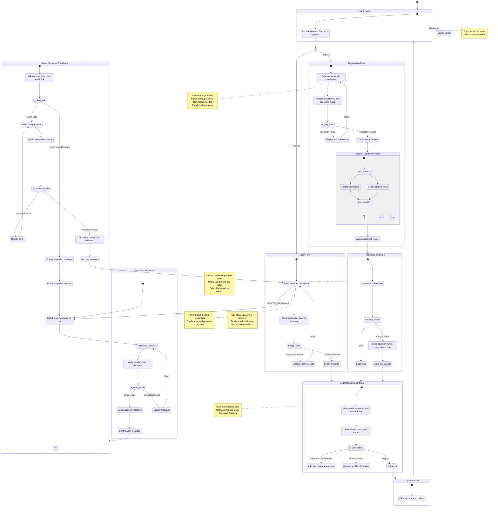

# User Journey - Login & Registration Module

## Overview
This diagram visualizes the complete user journey for authentication and registration in ReefMetrics, including login, registration, password recovery, and first-time user onboarding flows.

## Diagram

## Journey Description

### 1. **Unauthenticated User Journey**
- User lands on Home Page
- Presented with Login or Registration options
- No access to application features until authenticated

### 2. **New User Registration Journey**
- User clicks "Sign Up"
- Fills registration form (name, email, password)
- System validates email format and password matching
- On validation failure: error message displayed, user can retry
- On validation success: account created in database
- Welcome email sent (parallel to account creation)
- User automatically logged in
- Redirected to First Aquarium Setup
- User can add first aquarium or skip to dashboard

### 3. **Existing User Login Journey**
- User clicks "Sign In"
- Enters email and password
- System validates credentials against database
- On invalid credentials: error message, user can retry
- On valid credentials: session created, user redirected to dashboard

### 4. **Password Recovery Journey**
- User clicks "Forgot Password?" on login form
- Enters email address
- System verifies email exists in database
- If email found: password reset link sent via email
- User receives email with secure reset token
- User clicks reset link and is directed to reset form
- System validates reset token (checks validity and expiration)
- If token invalid/expired: user can request new link
- If token valid: user enters new password
- New password validated for strength requirements
- Password updated in database
- User can now login with new password

### 5. **Authenticated User Journey**
- User accesses dashboard after successful login
- Can view aquarium metrics
- Can manage aquariums (add, edit, delete)
- Can access profile settings
- Can initiate logout
- Logout terminates session and redirects to home page

## Key Decision Points

1. **Initial Authentication Decision**: Sign In vs. Sign Up
2. **Registration Validation**: Valid data vs. validation errors
3. **Login Validation**: Correct credentials vs. invalid credentials
4. **First-time Setup**: Add aquarium vs. skip to dashboard
5. **Password Recovery**: Email exists vs. email not found
6. **Token Validation**: Valid token vs. expired/invalid token
7. **Password Validation**: Strong password vs. weak password

