# UI Architecture Diagram - ReefMetrics Authentication Module

```mermaid
flowchart TD
    %% ============================================================================
    %% Layer 1: User Entry Points
    %% ============================================================================
    HomePage["Home Page<br/>index.astro"]
    LoginPage["Login Page<br/>login.astro"]
    RegisterPage["Registration Page<br/>register.astro"]
    ForgotPage["Password Reset<br/>forgot-password.astro"]
    ResetPage["Set New Password<br/>reset-password.astro"]
    Dashboard["Application Dashboard<br/>dashboard.astro"]
    ProfilePage["User Profile<br/>profile.astro"]
    AquariumsPage["Manage Aquariums<br/>aquariums.astro"]

    %% ============================================================================
    %% Layer 2: Layouts
    %% ============================================================================
    AuthLayout["AuthLayout.astro<br/>Authentication Layout"]
    MainLayout["Layout.astro<br/>Main Layout"]

    %% ============================================================================
    %% Layer 3: Astro Components
    %% ============================================================================
    AppHeader["AppHeader.astro<br/>Application Header"]

    %% ============================================================================
    %% Layer 4: React Components
    %% ============================================================================
    subgraph AuthForms["Authentication Forms"]
        LoginForm["LoginForm.tsx<br/>Login Form"]
        RegisterForm["RegisterForm.tsx<br/>Registration Form"]
        ForgotForm["ForgotPasswordForm.tsx<br/>Password Reset Form"]
        ResetForm["ResetPasswordForm.tsx<br/>New Password Form"]
    end

    UserMenu["UserMenu.tsx<br/>User Menu"]

    %% ============================================================================
    %% Layer 5: UI Components (Shadcn)
    %% ============================================================================
    subgraph UIComponents["UI Components - Shadcn"]
        InputUI["input.tsx"]
        ButtonUI["button.tsx"]
        LabelUI["label.tsx"]
        AvatarUI["avatar.tsx"]
        DropdownUI["dropdown-menu.tsx"]
        DialogUI["dialog.tsx"]
    end

    %% ============================================================================
    %% Layer 6: API Endpoints
    %% ============================================================================
    subgraph APIEndpoints["API Endpoints"]
        RegisterAPI["POST /api/auth/register"]
        LoginAPI["POST /api/auth/login"]
        LogoutAPI["POST /api/auth/logout"]
        ForgotAPI["POST /api/auth/forgot-password"]
        ResetAPI["POST /api/auth/reset-password"]
    end

    %% ============================================================================
    %% Layer 7: Services
    %% ============================================================================
    AuthService["AuthService<br/>- getCurrentUser()<br/>- signOut()"]
    ValidationService["Zod Validation<br/>- registerSchema<br/>- loginSchema<br/>- forgotSchema<br/>- resetSchema"]

    %% ============================================================================
    %% Layer 8: Infrastructure
    %% ============================================================================
    Middleware["middleware/index.ts<br/>Session Management"]
    SupabaseClient["Supabase Client<br/>Auth & Database"]
    SupabaseAuth["Supabase Auth<br/>Backend"]

    %% ============================================================================
    %% Connections: Pages to Layouts
    %% ============================================================================
    LoginPage --> AuthLayout
    RegisterPage --> AuthLayout
    ForgotPage --> AuthLayout
    ResetPage --> AuthLayout

    Dashboard --> MainLayout
    ProfilePage --> MainLayout
    AquariumsPage --> MainLayout
    HomePage --> MainLayout

    %% ============================================================================
    %% Connections: Layouts to Components
    %% ============================================================================
    AuthLayout --> LoginForm
    AuthLayout --> RegisterForm
    AuthLayout --> ForgotForm
    AuthLayout --> ResetForm

    MainLayout --> AppHeader
    AppHeader --> UserMenu

    %% ============================================================================
    %% Connections: Forms to UI Components
    %% ============================================================================
    LoginForm --> InputUI
    LoginForm --> ButtonUI
    LoginForm --> LabelUI
    RegisterForm --> InputUI
    RegisterForm --> ButtonUI
    RegisterForm --> LabelUI
    ForgotForm --> InputUI
    ForgotForm --> ButtonUI
    ResetForm --> InputUI
    ResetForm --> ButtonUI

    UserMenu --> AvatarUI
    UserMenu --> DropdownUI
    UserMenu --> ButtonUI

    %% ============================================================================
    %% Connections: Forms to Validation
    %% ============================================================================
    LoginForm --> ValidationService
    RegisterForm --> ValidationService
    ForgotForm --> ValidationService
    ResetForm --> ValidationService

    %% ============================================================================
    %% Connections: Forms to API
    %% ============================================================================
    LoginForm -->|onSubmit| LoginAPI
    RegisterForm -->|onSubmit| RegisterAPI
    ForgotForm -->|onSubmit| ForgotAPI
    ResetForm -->|onSubmit| ResetAPI
    UserMenu -->|handleLogout| LogoutAPI

    %% ============================================================================
    %% Connections: API to Services
    %% ============================================================================
    RegisterAPI --> AuthService
    LoginAPI --> AuthService
    LogoutAPI --> AuthService
    ForgotAPI --> AuthService
    ResetAPI --> AuthService

    %% ============================================================================
    %% Connections: Services to Supabase
    %% ============================================================================
    AuthService --> SupabaseClient
    SupabaseClient --> SupabaseAuth

    %% ============================================================================
    %% Connections: Middleware and Session Flow
    %% ============================================================================
    Middleware -->|attaches to| SupabaseClient
    Dashboard -.->|requires auth| Middleware
    ProfilePage -.->|requires auth| Middleware
    AquariumsPage -.->|requires auth| Middleware

    %% ============================================================================
    %% Navigation Flows
    %% ============================================================================
    HomePage -->|unauthenticated| LoginPage
    HomePage -->|unauthenticated| RegisterPage
    LoginPage -->|forgot password| ForgotPage
    ForgotPage -->|reset link| ResetPage
    RegisterPage -->|success| Dashboard
    LoginPage -->|success| Dashboard
    ResetPage -->|success| LoginPage
    Dashboard -->|logout| HomePage

    %% ============================================================================
    %% Styling
    %% ============================================================================
    classDef page fill:#e3f2fd,stroke:#1976d2,stroke-width:2px,color:#000
    classDef layout fill:#f3e5f5,stroke:#7b1fa2,stroke-width:2px,color:#000
    classDef astroComp fill:#fff3e0,stroke:#f57c00,stroke-width:2px,color:#000
    classDef reactComp fill:#e8f5e9,stroke:#388e3c,stroke-width:2px,color:#000
    classDef uiComp fill:#fce4ec,stroke:#c2185b,stroke-width:2px,color:#000
    classDef api fill:#f1f8e9,stroke:#689f38,stroke-width:2px,color:#000
    classDef service fill:#ede7f6,stroke:#512da8,stroke-width:2px,color:#000
    classDef infra fill:#ffebee,stroke:#d32f2f,stroke-width:2px,color:#000

    class HomePage,LoginPage,RegisterPage,ForgotPage,ResetPage,Dashboard,ProfilePage,AquariumsPage page
    class AuthLayout,MainLayout layout
    class AppHeader astroComp
    class LoginForm,RegisterForm,ForgotForm,ResetForm,UserMenu reactComp
    class InputUI,ButtonUI,LabelUI,AvatarUI,DropdownUI,DialogUI uiComp
    class RegisterAPI,LoginAPI,LogoutAPI,ForgotAPI,ResetAPI api
    class AuthService,ValidationService service
    class Middleware,SupabaseClient,SupabaseAuth infra
```

## Component Descriptions

### Pages
- **index.astro**: Home page - entry point, contains login and registration links
- **login.astro**: Login form (Email + Password)
- **register.astro**: Registration form (Email + Password + Confirmation)
- **forgot-password.astro**: Password reset request form (Email)
- **reset-password.astro**: New password form (Password + Confirmation)
- **dashboard.astro**: Application dashboard for logged-in users (protected)
- **profile.astro**: User profile (protected)
- **aquariums.astro**: Aquariums management (protected)

### Layouts
- **AuthLayout.astro**: Dedicated layout for authentication pages - centered form with logo
- **Layout.astro**: Main application layout - header, navigation, content

### React Components (Interactive)
- **LoginForm.tsx**: Manages login state, validation, form submission
- **RegisterForm.tsx**: Manages registration state and validation
- **ForgotPasswordForm.tsx**: Email input for password reset request
- **ResetPasswordForm.tsx**: New password form with token verification
- **UserMenu.tsx**: User dropdown menu with logout option

### Astro Components (Static)
- **AppHeader.astro**: Header with logo and user menu

### UI Components (Shadcn)
- Standardized components for building the interface
- Input, Button, Label, Avatar, DropdownMenu, Dialog

### API Endpoints
- **POST /api/auth/register**: New user registration
- **POST /api/auth/login**: User login
- **POST /api/auth/logout**: User logout
- **POST /api/auth/forgot-password**: Password reset initiation
- **POST /api/auth/reset-password**: Password reset completion

### Services
- **AuthService**: Authentication handling, get current user, logout
- **Zod Validation**: Validation schemas for each form

### Infrastructure
- **Middleware**: Session management, session cookie verification, attach user data
- **Supabase Client**: Interaction with backend (database, authentication)
- **Supabase Auth**: Remote authentication backend

## Main Flows

### Registration Flow
1. User on home page → clicks "Sign up"
2. Goes to `/register`
3. RegisterForm validates data → sends to `/api/auth/register`
4. API creates user in Supabase → creates profile → returns success
5. User automatically logged in → redirect to `/dashboard`

### Login Flow
1. User goes to `/login`
2. LoginForm validates data → sends to `/api/auth/login`
3. API authenticates with Supabase → returns user data
4. User session created → redirect to `/dashboard`

### Logout Flow
1. User clicks logout in UserMenu
2. Request sent to `/api/auth/logout`
3. API calls Supabase signOut → clears session
4. User redirected to home page

### Password Reset Flow
1. User on `/login` → clicks "Forgot password?"
2. Goes to `/forgot-password`
3. ForgotPasswordForm sends email to `/api/auth/forgot-password`
4. API sends reset email via Supabase
5. User clicks link from email → goes to `/reset-password?token=xxx`
6. ResetPasswordForm sends new password to `/api/auth/reset-password`
7. API updates password in Supabase → success message

## Security and Session

- **Middleware** verifies session cookie on every request
- **Protected pages** (dashboard, profile, aquariums) require authentication
- Unauthenticated users are redirected to `/login`
- Authenticated users are redirected from `/login` and `/register` to `/dashboard`

